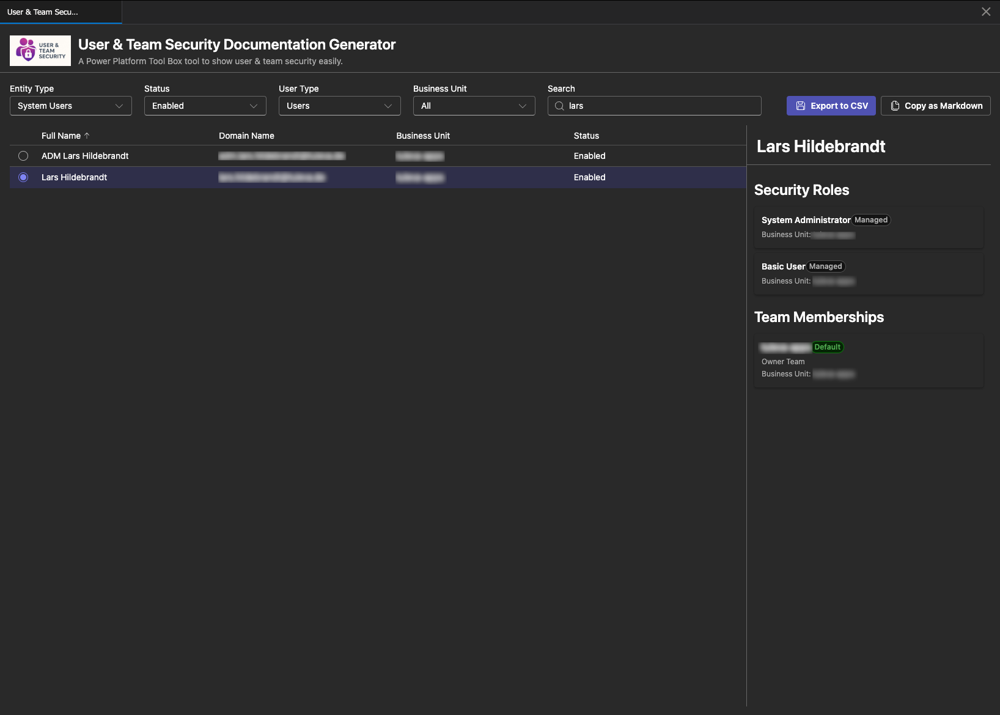
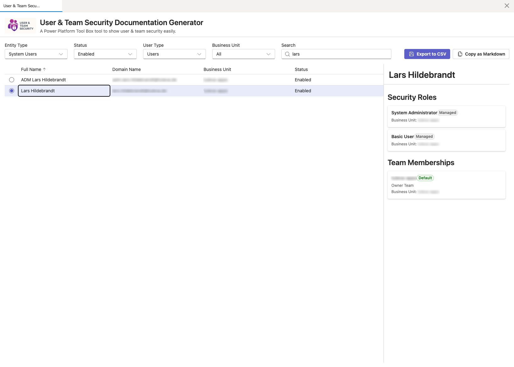

# Ownership Mover

  

  A Power Platform Toolbox (PPTB) tool to analyze Dataverse record ownership and reassign owned records from users or teams to a new owner.

## Screenshots

### Dark Theme

### Light Theme

## Features

- Analyze ownership for selected system users or teams
- Scan user-owned and team-owned Dataverse entities using metadata
- Show live analysis progress (processed, analyzed, failed entities, current entity)
- Filter owners by:
  - Entity type (System Users / Teams)
  - User status (All / Enabled / Disabled)
  - User type (All / Users / Applications)
  - Business unit
  - Free-text search
- Review ownership per owner with:
  - Total owned records
  - Entities with owned records
  - Entity-level record counts
- Reassign selected records to a target system user or team
- Download CSV exports:
  - Per-owner analysis summary
  - Complete analysis summary
  - Assignment history summary

## How It Works

1. Load system users and teams from Dataverse.
2. Select one or more owners in the grid.
3. Click **Analyze Ownership**.
4. Review entity counts in the results drawer.
5. Select entities to process.
6. Choose a target owner type and target owner.
7. Click **Assign selected records** to reassign ownership.

## License

MIT
